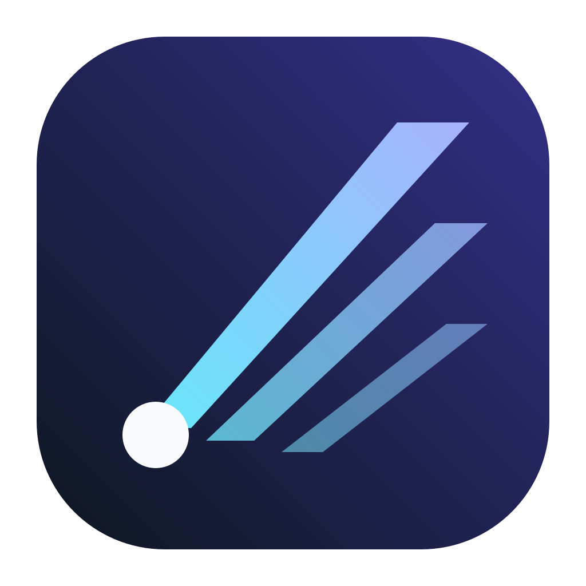

<p align="center">
  <picture>
    <source media="(prefers-color-scheme: dark)" srcset="apps/desktop/assets/icon.png">
    <source media="(prefers-color-scheme: light)" srcset="apps/desktop/assets/icon.png">
    
  </picture>
</p>

# Beam

Beam is a standalone agent orchestrator derived from BB. It can control, customize, and automate
itself, laying the groundwork for your own software factory.

Every surface — the desktop app, web app, CLI, and HTTP API — is a first-class
way to drive Beam. Work runs in threads you can follow live, steer at any point,
or hand off to another agent.

> [!NOTE]
> No Beam release has been published yet. Do not use upstream BB downloads or
> `npx bb-app` as a Beam installer.

## Build Beam locally

Beam currently has no public binary or npm installation path. From this
checkout, install dependencies and produce the separately installable Apple
Silicon application with:

```bash
npm exec -- pnpm install --frozen-lockfile
npm exec -- pnpm --dir apps/desktop run package
open apps/desktop/release/mac-arm64/Beam.app
```

The artifact is `apps/desktop/release/mac-arm64/Beam.app`. Its production state
defaults to `~/.beam`, its local server defaults to `http://127.0.0.1:48886`,
and the primary CLI is `beam`; `bb` is retained as a compatibility alias.

Do not globally export upstream values such as `BB_DATA_DIR=~/.bb`,
`BB_SERVER_PORT=38886`, `BB_HOST_DAEMON_PORT=38887`, or an upstream
`BB_SERVER_URL` when launching Beam. Explicit ambient `BB_*` overrides take
precedence and can intentionally defeat side-by-side isolation.

The internal `@bb/*`, `BB_*`, and workspace `.bb/` names remain compatibility
contracts to keep upstream synchronization practical. Workspace packages that
retain upstream npm coordinates are private and this fork does not publish into
upstream package namespaces. See [NOTICE](NOTICE) for attribution.

### Telemetry

Beam telemetry is disabled by default because this fork has no Beam-owned
analytics project. Operators can opt in for their own deployment by setting
`BB_POSTHOG_API_KEY` and `BB_TELEMETRY=true`. When enabled, Beam sends app starts,
thread creation counts, user message counts, and plugin installs. Identification
is a random per-install id stored in the data directory; no user, host, project,
workspace, or message content is attached. Plugin install events name only
public plugins. Development/source runs never send. See
[`apps/server/src/services/system/telemetry.ts`](./apps/server/src/services/system/telemetry.ts).
A separately deployed landing site also requires both `VITE_POSTHOG_KEY` and
`VITE_TELEMETRY=true` for browser analytics, and both `LANDING_POSTHOG_KEY` and
`LANDING_TELEMETRY=true` for worker-side download events.

## Development

Use the development loop when working on Beam itself:

```bash
pnpm dev
```

That starts the Vite app and proxies API and WebSocket traffic to a separate
dev server. The launcher prints the actual ports at startup. Each checkout gets
a data directory under
`~/.beam-dev/<checkout-instance>/` and deterministic high ports derived from the
checkout path. The checkout instance id is the sanitized path to the checkout,
relative to your home directory, plus a short hash suffix. Separate worktrees
can run alongside each other and a packaged production Beam instance.

To test the production bundle and serving path without switching to production
data or ports, use:

```bash
pnpm start:worktree
```

This builds the same optimized frontend and runtime artifacts as `pnpm start`,
then serves the app from the Beam server on the checkout-specific dev server port.
It keeps the normal checkout-specific dev data directory and host-daemon port.
There is no Vite dev server or hot reload in this mode; rerun the command after
source changes. As with `pnpm dev`, worktree starts do not send telemetry.

To run that same source dev server with the Electron desktop shell:

```bash
pnpm dev:desktop
```

This uses `scripts/beam-dev-app current --desktop`, which stops stale launcher
sessions, checks dependencies and native modules, starts the source dev server,
then opens the desktop shell against that dev app. The launcher prints the web
URL but does not open a browser unless you pass `--open`.

To use the dev app from another machine over Tailscale, run `pnpm dev`, note the
printed app port, and publish the loopback Vite listener:

```bash
tailscale serve --bg --https=443 http://127.0.0.1:<app-port>
```

Then open `https://<machine>.<tailnet>.ts.net`. Source dev binds both the Vite
app and main server to loopback by default; Vite continues to proxy API and
WebSocket traffic.

For direct access at `http://<tailscale-ip>:<app-port>` instead, run:

```bash
pnpm dev:remote
```

This binds the Vite app and main server to all IPv4 interfaces. The remote
browser must be able to reach both the printed app and server ports for realtime
updates. The server API is unauthenticated and permits command execution and
file reads, so use this only behind a trusted network boundary and restrict the
ports to Tailscale traffic with the host firewall when the LAN is not trusted.

To use the component storybook from another machine, run:

```bash
pnpm storybook
```

Ladle binds to all interfaces and configures its HMR WebSocket to use the
browser's current host instead of `localhost`. Do not run `pnpm storybook` on an
untrusted network.

Development behavior is intentionally split:

- the app hot reloads itself
- the server does not hot reload
- the host daemon does not hot reload

When you want the server and host daemon to pick up the latest build output, use:

```bash
pnpm dev:restart
pnpm dev:restart-server
pnpm dev:restart-host-daemon
```

These rebuild first, then restart only the targeted stateful services.

To run a production-mode build from a source checkout:

```bash
pnpm start
```

That builds only the app, server, and host-daemon runtime artifacts, then runs
the launcher directly against those workspace outputs. Use the `bb-app`
tarball smoke task when validating a locally built Beam package
layout.

```bash
pnpm beam --help            # built CLI, targets the default/prod instance
pnpm reset                # clear production state

pnpm beam:dev --help        # source CLI, targets this checkout's dev instance
pnpm reset:dev            # clear this checkout's dev state

pnpm reset:all            # clear both production and dev states
```

These reset commands prompt for confirmation before deleting anything.

## Repository Overview

See [Repository overview](docs/repository-overview.md) for the monorepo package and app map.

## System Overview

See [System overview](docs/system-overview.md) for runtime architecture, data model, and component boundaries.

## Further Reading

- [Vision](docs/VISION.md)
- [Platform support](docs/platform-support.md)
- [Configuration](docs/configuration.md)
- [Using Beam on multiple devices](docs/multiple-devices.md)
- [Worktrees and setup scripts](docs/worktrees.md)

## Contributing

See [CONTRIBUTING.md](CONTRIBUTING.md) for contribution guidelines.

## Troubleshooting

### `Could not locate the bindings file`

Beam uses native add-ons, including `better-sqlite3`, `node-pty`, and
`@parcel/watcher`. The package manager downloads or builds those binaries during
installation. If install scripts are blocked, Beam stops at startup with this
error:

```
Error: Could not locate the bindings file. Tried:
 → .../node_modules/better-sqlite3/build/better_sqlite3.node
```

Reinstall this checkout with lifecycle scripts enabled, then rebuild Beam:

```bash
npm_config_ignore_scripts=false npm exec -- pnpm install --force
npm exec -- pnpm --dir apps/desktop run package
```

A Node.js major-version change or a `node_modules` directory copied from another
operating system, CPU architecture, or libc variant can cause the same error.
Reinstalling dependencies for the current machine fixes those cases.

## Acknowledgements

<a href="https://blacksmith.sh"></a>
